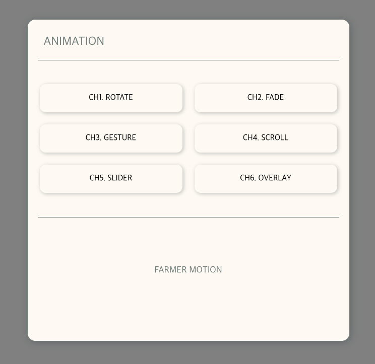

<br />
<div align="center">
  <a href="https://github.com/othneildrew/Best-README-Template">
    
  </a>

  <h3 align="center">FRAMER MOTION ANIMATION</h3>

  <p align="center">
    <a  href="https://www.gon2s-animation.site">View Demo</a>
  </p>
</div>

<br/>

<!-- TABLE OF CONTENTS -->
<details>
  <summary>목차</summary>
  <ol>
    <li>
      <a href="#about-the-project">About The Project</a>
    </li>
    <li><a href="#built-with">Built With</a></li>
    <li>
      <a href="#getting-started">Getting Started</a>
    </li>
    <li><a href="#contact">Contact</a></li>
  </ol>
</details>

<br/>

<!-- ABOUT THE PROJECT -->

## About The Project



React를 이용해 framer-motion에 대한 여러 애니베이션을 구현하기 위해 제작한 프로젝트 입니다.
6개의 애니메이션으로 구성되어 있으며,

- AnimatePresence
- useScroll
- useTransform
  <br/>

등을 이용해 제작한 애니메이션 입니다.

<br/>
<br/>

### Built With


<br/>

<br/>


<br/>
<br/>

<!-- GETTING STARTED -->

## Getting Started

1. Clone the repo
   ```sh
   git clone https://github.com/gon2s/react-animation.git
   ```
2. Install YARN packages
   ```sh
   yarn install
   ```
3. Start Project
   ```sh
   yarn start
   ```

<br/>
<br/>

<!-- CONTACT -->

## Contact

NAME > 유승곤
<br/>
EMAIL > qpple6@naver.com

<p align="right">(<a href="#readme-top">back to top</a>)</p>
